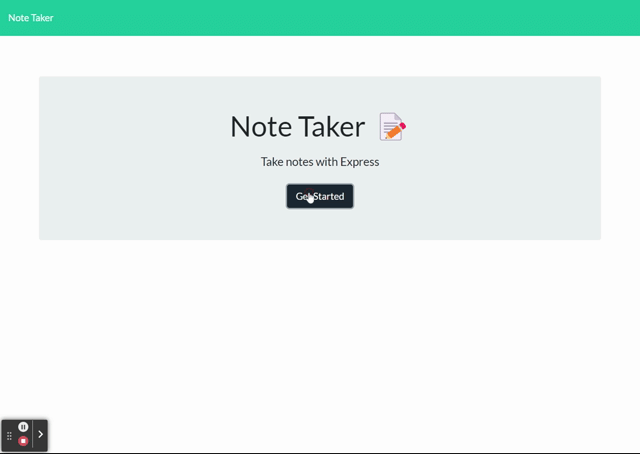
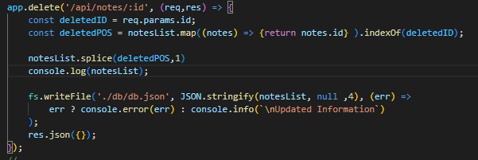

# noteTaking-mod11

This project allows the user to save notes and re-visit them later. As well as delete any note by clicking on the red trash bin icon on the left hand side of the page.
<br>[Deployed Link]( https://notetakingmod11.herokuapp.com/)

---

## Demo

Here is a short demonstration of the apps functionality from start to finish:



---

## Installation

To install the project in terminal run this command:

```bash
    git@github.com:fiaschettima/noteTaking-mod11.git
  ...

```
    
## Usage/Examples

To use the application 
```javascript
    cd noteTaking-mod11.git
    node server.js
```
This will Initialize the application and allow you to run the application on local host. After this is done you can use this link [http://localhost:3001/](http://localhost:3001/) to open the page. (note--this will only work if you have rane node server.js to start the local server)
Also worth mentioning when ready to close the application and no longer use it, in terminal enter 'CTRL C'

---

## Code Snippets

The code displayed below is an example of a delete route. The way this route works is when entered or actiaved by the delete button in this case, it will check the parameters in the route for an id matching any id currently stored in 'db.json'



---

## Tech Stack

**Client:** BootStrap, CSS, HTML

**Server:** Node, Express, uniqId, Path, FS

---

## Lessons Learned

This project provided the oppurtunity to gain a better understanding of using server side routes to link pages and update information using route parameters.

---

## License

[MIT](https://choosealicense.com/licenses/mit/)

---

## Badges

[](https://github.com/tterb/atomic-design-ui/blob/master/LICENSEs)

---

## Authors

- [@Matt Fiaschetti](https://github.com/fiaschettima)

